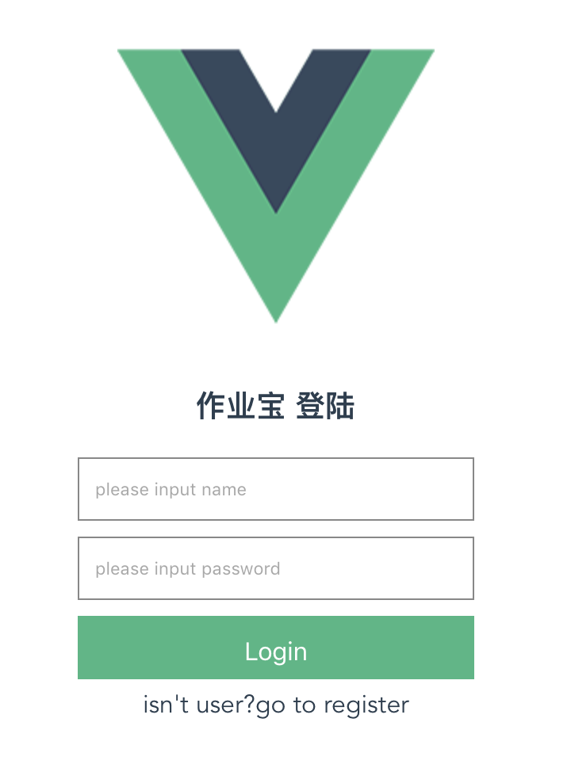
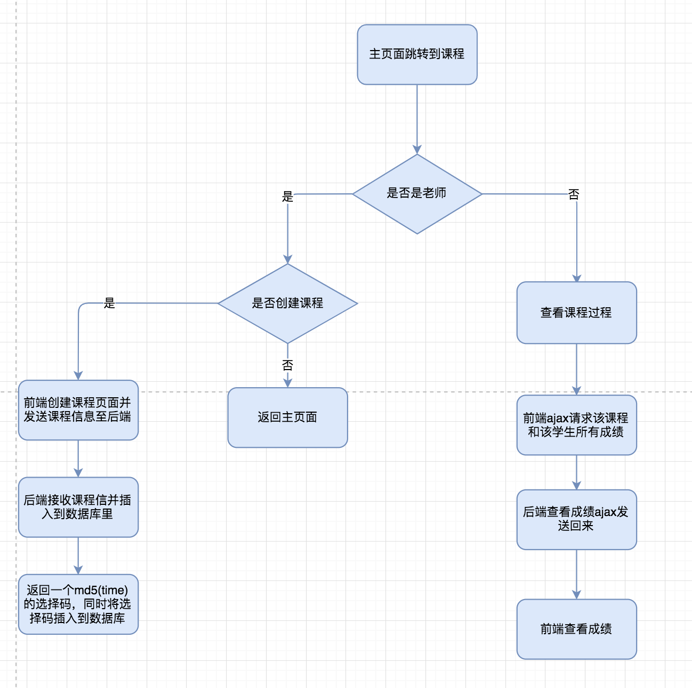

# 作业宝使用说明书

 作业宝 1.0    2018年6月9日

[TOC]

##  1. 引言

### 1.1  编写目的

本用户手册的主要读者为教师和学生，系统维护人员，每个功能均分为教师和学生两部分，其宗旨即为让用户明白软件使用流程。

图1  用户手册编写目的说明

### 1.2 项目背景

#### 1.2.1 项目来源

项目通过中南大学老师提出，中南大学学生李源负责润色，设计和实现，项目主要是面对目前中国高等教育现状的痛点，希望能够让老师的教学工作中和教学评价工作复杂工作自动化，同时希望能让学生的测验标准和学习成绩评定标准量化。于是针对该项目，我们进行了实现。

#### 1.2.2 委托单位

委托单位为中南大学地理信息专业。

#### 1.2.3 开发单位

开发单位为中南大学地理信息专业1602班开发小组。

#### 1.2.4 主管部门

主管部门为，中南大学地理信息专业1602班开发监督委员会。

### 1.3 定义

专业术语及定义

> 数据挖掘：指通过对数据进行分析工作，而从海量数据中提取知识的工作
>
> 数据分析：对数据的分析工作。
>
> 数据评价：对数据质量的评价，根据某个指标对数据在某个方面的可用性和可操作性进行评价
>
> 教学质量反馈报告：关于老师的教学质量的反馈报告
>
> 成绩评定：对成绩好坏的评定报告
>
> 时间序列预测：随时间变化的数列的人工预测行为
>
> 卷积：参数化求解方法的一种，通常指图片的卷积操作

缩写词定义

>RNN：循环递归神经网络，重要的时间序列优化预测算法

### 1.4 参考资料

> a.开发计划
>
> b.需求规格说明书
>
> c.概要设计说明书
>
> d.详细设计说明书
>
> e.测试计划

## 2.软件概述

### 2.1 目标

该软件的实现目标分为对老师和学生两部分：

针对老师的目标

> 1. 将老师从沉重的批改作业中解脱出来
> 2. 将老师从沉重的班级作业数据分析中解脱出来
> 3. 提供给老师更加详实班级和学生个人的数据分析报告，全部定量化参数
> 4. 提供给老师收作业和发布作业，发布测验，统计测验的结果，让收作业和发布作业的工作定量化
> 5. 提供在线阅览功能，让老师的批改那些主观题的时间可以碎片化
> 6. 期末自动出题的功能

针对学生的目标

> 1. 告诉学生你的薄弱的点在哪里，哪节课，哪一块出现了问题，这样学生的查漏补缺和修改就会有针对性
> 2. 告诉学生的复习计划
> 3. 提供给学生成绩的分析，比如学生成绩趋势的分析，如学生的成绩下降就及时提醒，并提交信息给辅导员
> 4. 提供给学生题库进行针对性的练习

### 2.2 功能 

#### 2.2.1 登陆

##### 功能说明

> 登陆功能主要有以下几个功能小点
>
> 1. 登陆角色判定
> 2. 登陆角色权限控制以及登陆之后的功能控制
> 3. 登陆有状态和无状态链接的标示与控制
> 4. 登陆模块关于登陆结果的结果传递
> 5. 登陆模块关于登陆错过

功能具体流程如下：

	

图2  登陆模块流程结构图

对于登陆功能来说，老师和学生在这个功能上的界面上差别不大，但是老师和学生的登陆效果却完全不相同。

以下为具体说明：

##### 用户登陆界面及说明：

图3  手机端登陆界面

所有用户在如上界面进行登陆，如果登陆成功则出现一下界面

图4 左图为老师登陆的界面 右图为学生登陆后的界面

如图琐事，老师登陆后，会出现自己上的课以及对应所需上课的班级等，学生登陆后，会出现需要上的课，以及下次上课的时间和地点，上课老师和学生均有不同的界面和处理过程。

#### 2.2.2 注册

##### 功能说明
> 注册功能主要有以下几个功能小点
>
> 1. 注册角色判定
> 2. 注册角色权限控制以及注册之后的功能控制
> 3. 注册邮箱所有权验证模块

注册功能具体流程如下：

	

图5  注册功能流程结构说明

##### 注册UI说明

对于注册功能的手机端来说，学生和教师在这个功能上没有区别，

图6 注册UI说明

用户输入对应的邮箱以及注册的密码，然后服务器后台会发送给输入邮箱一封账号激活邮件，用户点击激活邮件，并登陆，则账号成功注册。

#### 2.2.3 注销

##### 注销功能说明：

注销功能需要保证一下几点：

> 1.能够退出登陆账号并且重置链接的状态
>
> 2.能够提供注销账号的服务
>
> 3.能够快速的进行切换，回退到登陆界面

##### 注销功能具体ui说明

图7 注销UI说明

其中点击退出的蓝色按钮为退出账号登陆状态，但是不注销，红色按为注销登录状态，而且退出。

#### 2.2.4 联系我们

用户直接点击进入app应用时的联系我们，那么就可以直接进入以下界面，和应用后台管理员以及开发人员发送您的bug信息以及疑问。

图8 联系我们I说明

如上，为发送bug信息之前的对话。

####  2.2.5 测验

针对测验功能老师和学生有不同的测验功能和界面与登录同。

##### 测验功能说明：

> 对于老师：
>
> > 1.提供测验发布功能，
> >
> > 2.提供测验自动批改功能
> >
> > 3.提供测验的数据的汇总展示功能
> >
> > 4.提供测验的修改和选择性整合功能
> >
> > 5.进入阅卷功能的功能
>
> 对于学生：
>
> > 1.提供在线按时，实时的答题功能
> >
> > 2.提供测验结果查看功能

测验功能具体功能流程如下：

图9 阅卷功能流程结果说明

##### 测验ui说明：

老师:

图10 测验UI说明（老师）

学生：

图11 测验UI说明（学生）

老师通过pc端的发布测验界面，发布对应的测验，而学生则通过手机端进行答题。发布界面的pc端登录与注册的ui，如下列所示：

老师pc端登陆功能：

图12 老师pc端登陆UI

老师pc端注册功能：

图13 pc端注册UI（老师）

老师在pc端上发布测验的ui如下图所示：

老师pc端发布测验ui

图14 pc端发布测验UI（老师）

#### 2.2.6 作业

针对作业功能老师和学生有不同的测验功能和界面与登录同。

##### 作业功能说明：

> 对于老师：
>
> > 1.提供作业发布功能，
> >
> > 2.提供作业自动批改功能
> >
> > 3.提供作业的上交功能
> >
> > 4.提供作业的的修改和数据整合功能
> >
> > 5.进入阅卷功能的功能
>
> 对于学生：
>
> > 1.提供在线按时的交作业功能
> >
> > 2.提供作业结果查看功能

作业功能具体流程如下：

图15 作业模块流程结果说明

##### 作业UI说明

对于作业功能来说，学生和老师均有不同的工作界面：

老师的手机端工作界面：

图16 作业手机端UI（老师）

学生的工作界面：

图17 作业手机端UI（学生）

老师通过老师作业界面发布任务或者选择性跳转到阅卷功能中去，而学生则通过作业界面进行答题，对老师发布的任务作答并上交作业。

老师pc端的登陆和注册功能如测验功能结尾图

老师发布作业的ui如下图所示：

老师pc端测验工作ui

图18 pc端测验工作UI（老师）

#### 2.2.7 阅卷

阅卷功能介绍：

所有的关于用户的权限的设定均在测验和作业模块内完成，所以阅卷功能只提供阅卷一个功能，数据通过接口进行传入，

##### 阅卷功能说明

阅卷功能介绍如下：

> 阅卷功能不对学生和老师进行区分，因为学生需要看自己的卷子而老师需要看学生的卷子，所以在阅卷功能上，老师和学生的功能不做区分
>
> 主要功能说明：
>
> > 1. 在传递api数据的情况下，提供作业的阅卷功能
> > 2. 在传递api数据的情况下，提供测验的阅卷功能
> > 3. 在传递api数据的情况下，提供作批改的功能              
>

阅卷功能具体说明：

图19 阅卷模块流程结果说明

#####阅卷Ui说明

图20 阅卷pc端UI说明

####  2.2.8 课程

##### 课程功能说明：

课程功能主要负责在主页面显示各个课程的测验和作业情况，以及提供给测验和作业入口的链接。

对于学生来说：

> 1. 主页面显示课程以及课程对应的测验和作业，以及进入测验和作业的接口
> 2. 主页面显示课程加入功能

对于老师来说：

> 1. 主页面显示课程以及课程对应的测验和作业，以及进入测验和作业的接口
> 2. 主页面显示编辑课程的功能
> 3. 给编辑测验和作业提供接口

课程功能模块流程具体说明：

图21 课程功能模块流程结构说明

##### 课程UI说明：

对于老师而言：

图22 课程功能Ui说明（老师）

对于学生而言：

图23 课程功能Ui说明（学生）

其中老师和学生点击相同按钮会出现不同的结果，如果是老师点击加号会是编辑课程的界面，如果是学生点击加号

#### 2.2.9 题库

##### 题库功能说明

题库功能主要负责对已有的题目的资源的整合，我们希望能够通过对已有的题目做一些整合的工作，让老师和学生从中受益。

对于老师来说：

> 1. 提供根据关键词自动出题（适应于作业和测验），从复杂的出题工作中解脱，通过和其他人一起贡献一个专业的题库，进而让工作完善和简单。
> 2. 提供全覆盖的出题（适应于期末）。
> 3. 保存这些题目

对于学生来说：

> 1. 提供学生复习时的针对性练习的支撑。

##### 题库ui说明

由于主要是老师操作题库，只对学生的各个模块的提供数据支撑，所以用户可见的功能就是老师的操作题库的功能。功能ui如下：

图23 题库Ui说明

老师在pc端通过如上的功能界面过滤和导出题目，并选择发布到测验和作业。

#### 2.2.8 成绩数据分析功能

##### 数据分析功能说明

数据分析功能是分析学生的作答情况，得出学生，班级，年级的在某阶段和完整学期的学习情况，并将其以可视化的形式显示给用户。所以该功能对老师和学生的功能是不同的。

对于学生，

> 1. 提供个人学习过程中的学习情况报告结果
>
> 2. 提供复习指南功能

对于老师，

> 1. 提供关于个人，班级和年级的学习情况指南结果
> 2. 提供关于较虚的指南

具体功能流程如下：

图24 成绩数据分析模块流程结构说明

##### 成绩数据分析功能的ui说明：

对于学生来说：

图25 成绩数据分析功能UI说明

对于老师来说：

个人成绩查看结果于上相同，班级成绩查看ui如下所示：

#### 2.2.10  上传题目

##### 上传题目功能介绍：

由于题库功能只是消费题目到不同的应用场景，而老师需要将自己的部分原创成果上传到题库，所以提供对应的私有功能，所以上传题目功能主要负责题目的上传。

对于该功能而言:

> 1.提供给老师上传题目的功能，用于题库的建设，测验还有作业等功能

上传题目功能具体流程：

图26 上传题目模块流程结构说明

#####上传题目ui说明

图27 上传题目ui说明

如图所示：

老师通过点击单选和多选添加题目，通过黄色按钮进行上传，通过题库随机设置从上面的题库进行导出（题库功能结合接口），通过考试常用设置，选择上传的题目是加入到题库中，还是仅仅用于测验和作业。

#### 2.2.11 运营维护功能

##### 运维功能说明

考虑到系统上线中，需要对系统进行运营维护的工作，所以我们提供如下运营维护的功能：

功能如下：

> 1. 提供服务器log文件导出功能
> 2. 提供数据库服务文件导出功能
> 3. 提供服务器客户端运行log导出功能，
> 4. 提供给运维用户环境配置的功能

运维功能模块说明

图28 运维模块流程结构说明

##### 运维功能 UI说明

对于该功能而言，其面向的微系统运维人员，具有非常好的运维知识体系，所以ui设计非常简单的命令行，如下:

图29 运维模块UI说明

### 2.3 性能

该系统的性能因为考虑了高并发的架构，所以整个架构在可控的范围内可以维持高性能，如果是

主服务器为：intel至强处理器V4+1t内存+ 3T的外存，那么整个系统应该应付超过1万qps，如果分布式通过负载均衡来进行配置服务的话，那么2台服务器叠加会对整个效果产生一些削弱，削弱效果取决于nginx负载均衡服务器的效果。

## 3 运行环境

### 3.1 硬件 

硬件为：主服务器为intel至强处理器V4+1t内存+ 3T的外存，其他服务器为intel至强处理器V2+1t内存+ 3T的外存，整个系统通过一个重定向服务器进行控制：intel至强处理器V4+1t内存+2t外存。

这么配置的原因是，重定向和负载均衡服务器对内存和处理器的要求较高，对外存的要求不高，因为如果负载均衡的操作需要用到外存的话，那么就意味着我们对用户的响应在1秒内无法解决，就意味着必须提高nginx的能力，以及通过dns来进行分级分配（比如东北和中南的百度访问一定不是在同一个服务器上）

同时硬件所搭配的软件必须为centos。

### 3.2 支持软件

整个系统的软件选择如下所示：

> 1.数据库 oracle/postgresql
>
> 2.web容器 tomcat
>
> 3.操作系统 选择centos
>
> 4.负载均衡器容器 nginx
>
> 5.web框架 ssm

## 4 使用说明

### 4.1 进入系统

####  学生和老师进入系统

均为登陆界面进行登陆，如登陆功能中图3所示。

#### 管理员登陆运维系统

通过ssh进行登陆，登陆成功界面如下图所示：

在如上系统中进行进一步的操作

### 4.2 维护重要数据格式说明

##### 4.2.1  数据背景与数据格式

本项目数据工程较为复杂，但主要来说分为以下数据

> 1. 题库内部保存的题目数据  json形式保存在数据库题库表格中的text字段中
> 2. 其他表格保存的题目数据  按数据库外键组织保存
> 3. 其他表格保存的成绩数据 按数据库外键进行存储
> 4. 其他表格保存的答题数据 按照数据库外键进行存储
> 5. 其他表格保存的用户数据 按照数据库外键进行存储

##### 4.2.3 举例 

1. 题库

   > 

2. 题目数据

   > 题目本身数据
   >
   > 
   >
   > 题目答案数据
   >
   > 

3. 成绩数据

   > 

4. 答题数据

   > 

5. 用户数据

   > 

## 5. 运行说明

#### 5.1 运行过程

项目运行过程如果正常回显示如下所示的log信息：

## 6.非常规过程

1.如果redis服务器不正常则会出现以下问题：

2.如果mysql数据库不正常则会出现如下的问题：

3.如果是服务器网络运行环境不正常则会出现如下问题：

## 7.程序及数据文件一览表

程序总体结构如下所示：

图30 项目代码结构图

对程序的总体结构进行分析：

其中:

> Controller 		主要是视图的控制层
>
> Dao.		   	主要是mybatics框架使用时必须Dao 对于多表DTP进行整合然后持久化映射，并将				   对数据库对象的修改
>
> Dto 			    主要是单表得出的结果，对单表的结果进行对象持久化映射
>
> job                               主要是消息队列中，可以执行的写死的job
>
> model			  主要是一些重要的可复用的代码
>
> mq				主要是消息队列配置及任务代码
>
> service			 主要是多个数据库服务的封装
>
> test				主要是测试模块的代码
>
> Resources		    主要是资源代码，我们系统的大多数资源都是保存在resource环境内，包括后端所				      有的配置文件
>
> webapp			主要是webapp前端的代码
>
> ​	WEB-INF	    主要是各框架的配置文件 提供springmvc的配置文件，将url和controller对应起来
>
> ​	views		  主要是views，这个里面主要放jsp文件
>
> 

整个框架是常规的javaweb。

